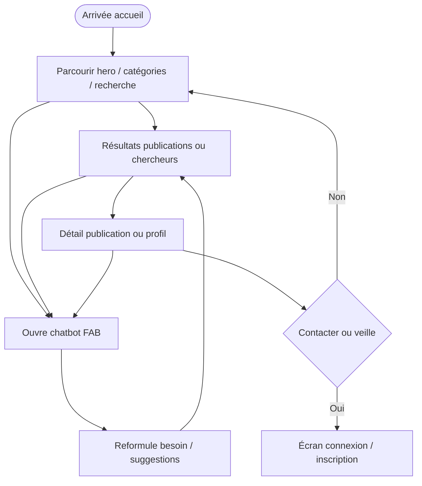
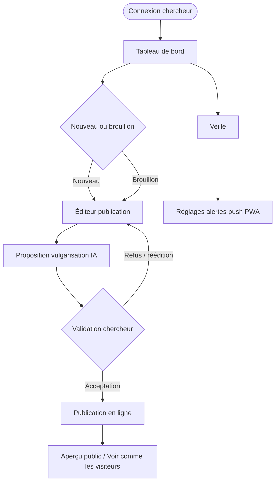
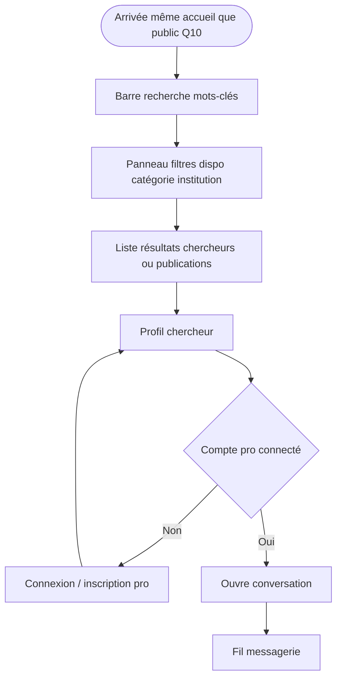

# Lab Horizon — Flux utilisateurs détaillés (personas)

Trois parcours prioritaires : **visiteur + chatbot**, **chercheur (publication + validation IA)**, **professionnel (recherche + filtres + message)**.

---

## 1. Visiteur / étudiant — découverte + chatbot

**Objectif** : explorer publications et profils sans compte ; utiliser le LLM pour affiner la recherche documentaire (Q11).

**Points d’attention UX**

- Message clair sur les actions verrouillées : *« Créez un compte chercheur pour publier »* / *« Connectez-vous pour contacter »*.
- Le chatbot reste disponible **sans** compte (Q11).

---

## 2. Chercheur — journée « réussie » : publication + validation IA

**Objectif** : publier ou mettre à jour ; validation **systématique** avant mise en ligne (Q3) ; aperçu public (Q10).

**Micro-copy suggérée (hors scope fichier copy PWA)** : après validation, écran de confirmation + lien direct *« Voir ma fiche publique »*.

---

## 3. Professionnel — recherche + filtres + message

**Objectif** : mots-clés en priorité (Q7) ; filtres disponibilité, catégorie, institution ; contact par **messagerie in-app** (Q8), sans exposition mail/téléphone en V1 si aligné Q9.

**Variante** : depuis résultats **publications** → détail papier → profil auteur → message (flux linéaire recherche thématique).

---

## 4. Synthèse des sorties / états d’erreur (transversal)

| Étape | État | Comportement |
|-------|------|----------------|
| Envoi message | Destinataire indisponible | Message in-app + retry |
| Validation IA | Échec génération | Brouillon sauvegardé + message explicite |
| Recherche | Zéro résultat | Suggestions catégories + chatbot |

---

## 5. Admin (rappel)

Parcours **séparé** : authentification forte, pas de chemin depuis l’app grand public (sécurité perçue). Détail dans [01-sitemap-validation.md](./01-sitemap-validation.md).

---

*Document d’implémentation du plan Lab Horizon UX — fichier plan source non modifié.*
