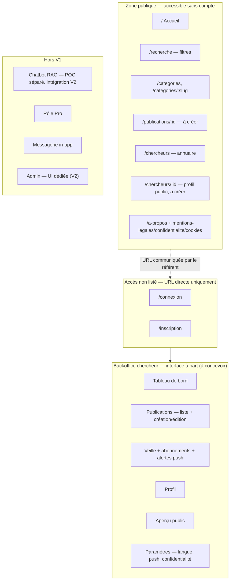

# Lab Horizon — Pages, rôles et feuille de route (V1 / V2 / V3)

Document de synthèse issu des arbitrages produit du 07/07. Complète, sans les contredire,
`01-sitemap-validation.md` et `04-user-flows-personas.md`. En cas de divergence sur un point
déjà tranché ici, **ce document prévaut** pour le périmètre V1 tant qu'il n'est pas mis à jour.

---

## 1. Rôles V1 (rappel)

Un seul rôle **applicatif front** en V1 : **chercheur**. Le grand public ne crée pas de compte.

| Rôle | Où | Statut V1 |
|------|----|-----------|
| Visiteur (public) | Frontend React | Actif — aucune connexion |
| Chercheur | Frontend React (espace `/compte`) | Actif — accès par URL directe, non listée dans la nav publique |
| Admin | **Laravel uniquement** (pas d'UI dédiée en V1) | Actif mais **lecture seule / supervision** |
| Pro | — | Hors V1 (backlog V2, cf. sitemap §5) |

---

## 2. Décision — Admin (V1 vs V2)

**V1** : un rôle `admin` existe côté Laravel. Il peut **tout consulter** (utilisateurs, publications,
catégories) mais **ne modifie rien directement** via une action destructrice ou de contenu —
objectif : limiter la surface d'abus / erreur humaine tant qu'il n'y a pas d'interface dédiée
et de workflow de modération formalisé.

**V2** : l'admin devient un véritable outil de **maintenance de contenu pour non-devs**, avec au
minimum :
- basculer un article `PUBLISHED` ↔ `PRIVATE`/`DRAFT` sans passer par un déploiement,
- gérer les catégories,
- consulter un journal d'audit des actions.

**Impact modèle de données (dev back)** : prévoir dès V1 le champ `role` (enum incluant `ADMIN`)
et un `status` sur `publication` qui permette ce bascule en V2 sans migration lourde
(cf. `docs/data-dictionary-v1.md`, entité `publication.status`).

---

## 3. Décision — Accès connexion / inscription (V1)

**V1** : la connexion et l'inscription **ne sont pas exposées dans la navigation grand public**.

- Retiré du header public : lien *« Vous êtes chercheur ? »* (`/inscription`) et bouton
  *« Connexion »* (`/connexion`).
- Retiré de la page « À propos » : lien *« Espace chercheur »*.
- Les routes `/connexion` et `/inscription` **restent fonctionnelles** et accessibles par URL
  directe — seul le référent chercheur côté IUT communique ce lien aux chercheurs concernés.

**À redébattre plus tard** : mécanisme d'inscription définitif — piste envisagée : validation
par un admin (ex. par email) plutôt qu'une inscription libre. Pas d'implémentation attendue
côté back tant que ce point n'est pas retranché.

**Point ouvert non trancher ici** : le lien « Compte » reste pour l'instant dans le header
desktop (nav principale) et pointe vers `/compte`, qui n'a **aucun contrôle d'accès** actuellement
(page mock, données en dur). Ce point est couvert par la décision §5 (refonte de l'espace connecté) —
à traiter ensemble avant la V1 pour décider si ce lien doit lui aussi disparaître de la nav publique
et si `/compte` doit être gardé derrière une vraie authentification avant recette.

---

## 4. Décision — Chatbot IA (RAG)

**Reporté en V2.** Pas d'hébergement local disponible actuellement pour le service RAG.

- Un **POC est mené en parallèle, hors de ce dépôt**.
- Le chatbot ne sera intégré au projet Lab Horizon **que lorsqu'un serveur dédié sera disponible**.
- Aucun composant chatbot (FAB, panneau, mock) n'est à prévoir côté frontend en V1.

**Impact CDC** : le CDC v2 (§3.3) liste l'assistant IA comme fonctionnalité V1 « synthèse » — ce
document acte son report effectif en V2 pour raisons d'infrastructure ; à faire valider par la
direction IUT en instance de suivi si le CDC doit être amendé formellement.

---

## 5. Décision — Espace connecté chercheur (`/compte`)

Les besoins de l'espace connecté sont **suffisamment différents** de l'expérience publique
(navigation, densité d'info, actions de gestion) pour justifier une **interface à part**, de
type **Backoffice**, plutôt qu'une simple sous-arborescence de l'app publique.

- **Hébergement** : au même endroit (même domaine / même déploiement), pas un service séparé.
- **UX / parcours** : à concevoir ensemble dans une session dédiée, après validation du sitemap
  ci-dessous — ne pas anticiper le détail écran par écran avant cette session.
- **Conséquence technique probable** (à confirmer en session UX) : layout dédié (pas
  `SiteHeader`/`SiteBottomNav` public), routing propre, éventuellement build ou point d'entrée
  distinct selon la décision finale.

---

## 6. Sitemap V1 consolidé (après arbitrages)

---

## 7. Feuille de route V1 → V3

```mermaid
flowchart LR
  subgraph V1 ["V1 — fin août / septembre"]
    V1a["Public complet : accueil, recherche, catégories,\npublication détail, annuaire, profil chercheur public"]
    V1b["Connexion/inscription — accès URL directe"]
    V1c["Backoffice chercheur — dashboard, publications, veille, profil, paramètres"]
    V1d["PWA installable + push veille"]
    V1e["Admin Laravel — lecture seule"]
  end
  subgraph V2 ["V2"]
    V2a["Chatbot RAG (dès serveur dédié disponible)"]
    V2b["Admin — maintenance contenu (statut publication, catégories, audit)"]
    V2c["Rôle Pro + messagerie in-app"]
    V2d["Inscription : mécanisme de validation (email/admin) si retranché"]
  end
  subgraph V3 ["V3"]
    V3a["Annonces de recherche (espace pro)"]
    V3b["Modération avancée / file d'attente admin"]
    V3c["Multi-catégories / multi-auteurs HAL étendus"]
  end
  V1 --> V2 --> V3
```

---

## 8. Changements front déjà appliqués (07/07)

| Fichier | Changement |
|---------|------------|
| `frontend/src/components/chrome/SiteHeader.tsx` | Retrait du lien « Vous êtes chercheur ? » et du bouton « Connexion » de la nav publique |
| `frontend/src/pages/AboutPage.tsx` | Retrait du lien « Espace chercheur » |

Routes `/connexion`, `/inscription`, `/compte` non modifiées — toujours joignables par URL.

---

## 9. Points ouverts (à trancher avant recette V1)

- [ ] Le lien « Compte » du header desktop reste-t-il visible publiquement, ou doit-il disparaître
      lui aussi tant que le Backoffice n'a pas de vraie authentification ?
- [ ] Mécanisme d'inscription définitif (validation admin / email) — impacte le modèle `user`.
- [ ] Session UX dédiée à planifier pour concevoir le Backoffice chercheur (post-sitemap).
- [ ] Formaliser auprès de la direction IUT le report du chatbot en V2 (écart avec CDC v2 §3.3).

---

*Document vivant — mettre à jour à chaque arbitrage produit touchant pages, rôles ou périmètre de version.*
