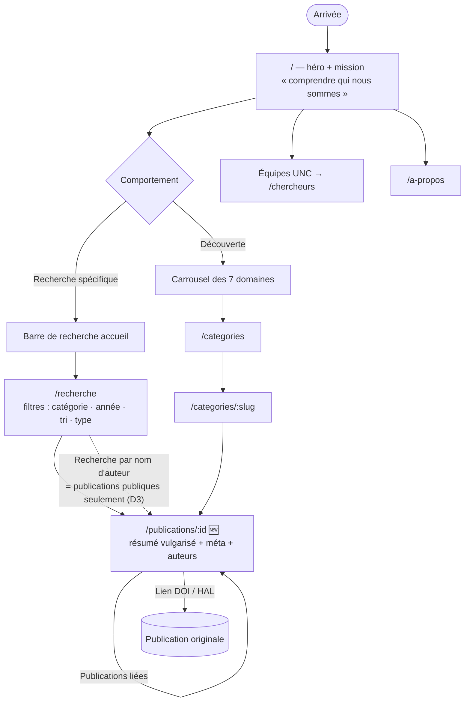
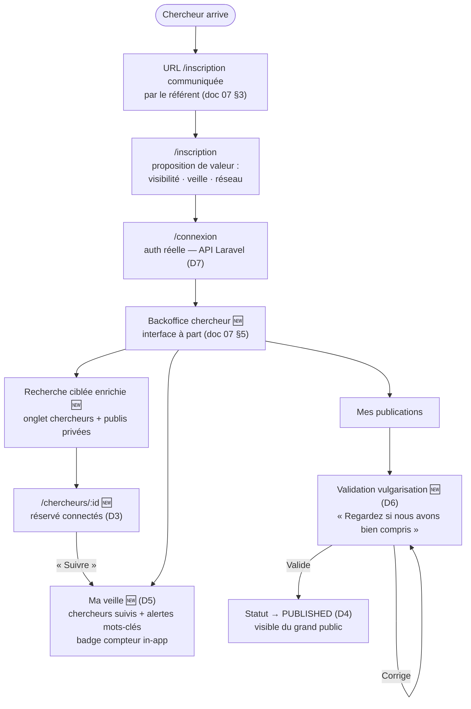

# Lab Horizon — Parcours utilisateur V1 (grand public + chercheur)

Document issu de la session de cadrage du **15/07**. Il complète [04-user-flows-personas.md](./04-user-flows-personas.md)
et [07-pages-roles-roadmap.md](./07-pages-roles-roadmap.md), et **met à jour** le sitemap §6 du doc 07 sur un point :
la **visibilité des profils chercheurs** (voir §2, décision D3). En cas de divergence, ce document prévaut.

**Objectif** : modéliser les parcours réels, identifier les pages et fonctionnalités manquantes,
et valider la direction de l'architecture front.

---

## 1. Rappel du périmètre V1

- **Front public fonctionnel** pour le grand public / étudiants — sans compte.
- **Version simplifiée de l'espace chercheur** — vraie authentification et rôles (API Laravel + SQLite).
- **Hors scope V1 (assumé)** : chatbot RAG et génération LLM des vulgarisations (POC mené hors dépôt).
  ⚠️ Le **flux de validation** de la vulgarisation reste en V1 : le contenu vulgarisé est mocké/pré-généré,
  seul le *mécanisme* (proposer → relire → valider/corriger → publier) est implémenté.

---

## 2. Décisions de cadrage (15/07)

| # | Décision | Détail |
|---|----------|--------|
| D1 | **Compte réservé aux chercheurs** | Le grand public navigue sans compte (confirme doc 07 §1). |
| D2 | **Page détail publication complète** | Résumé vulgarisé + méta (auteurs, date, catégorie) + lien publication originale (DOI/HAL) + publications liées. |
| D3 | **Profils chercheurs visibles entre chercheurs uniquement** ⚠️ *met à jour doc 07 §6* | Le grand public ne voit un chercheur que comme **nom d'auteur sur les publications publiques**. Il peut rechercher par nom, mais n'obtient que des articles — jamais de fiche profil. La fiche `/chercheurs/:id` est réservée aux chercheurs connectés. |
| D4 | **Statut de visibilité sur les publications** | Chaque publication a un état public / non public (aligné sur `publication.status` du data-dictionary : `PUBLISHED` / `PRIVATE` / `DRAFT`). Le public ne voit que `PUBLISHED`. |
| D5 | **Veille in-app** | Page « Ma veille » agrégeant les nouveautés des chercheurs suivis + alertes mots-clés, avec badge compteur. Pas de push en V1 (mécanisme prévu doc 05 pour plus tard). |
| D6 | **Flux de validation vulgarisation** | « Nous avons vulgarisé votre travail pour vous rendre visible du plus grand nombre — regardez si nous avons bien compris. » Le chercheur relit, corrige ou valide ; la validation publie. |
| D7 | **Vraie authentification** | Backend Laravel + SQLite, API REST. V1 = vraie auth + rôles (`visiteur` implicite, `chercheur`, `admin` Laravel lecture seule cf. doc 07 §2). |
| D8 | **Filtres de recherche standard** | Catégorie + année + tri (récent/pertinence) + type (publication/chercheur — l'onglet chercheurs n'apparaissant qu'en connecté, cf. D3). |

---

## 3. Personas et comportements types

### Grand public / étudiant (sans compte)

Deux comportements distincts, tous deux servis par le front public :

1. **Recherche spécifique** — il sait ce qu'il cherche (sujet, mot-clé, nom d'auteur) → barre de recherche → résultats filtrés → lecture vulgarisée.
2. **Découverte** — il ne sait pas encore ce qu'il cherche → catégories/domaines → exploration → lecture → rebond.

### Chercheur (compte requis)

Quatre objectifs, dans l'ordre du parcours :

1. **Comprendre où se connecter/s'inscrire et ce que ça lui apporte** (proposition de valeur).
2. **Recherche ciblée** rapide une fois connecté.
3. **Suivre des chercheurs et faire de la veille** dans un domaine ciblé (alertes, automatismes).
4. *(Bonus V1)* **Rendre ses travaux accessibles** via le flux de validation de vulgarisation.

---

## 4. Parcours grand public

### 4.1 Étapes

| Étape | Page / élément | État actuel |
|-------|----------------|-------------|
| 1. Arrivée — comprend qui nous sommes | `/` héro + section mission | ✅ En place |
| 2. Voit rapidement où chercher | Barre de recherche sur l'accueil (`form → /recherche?q=`) | ✅ En place |
| 3a. Recherche spécifique | `/recherche` : requête + filtres catégorie/année/tri/type | 🔶 Partiel — filtres année/tri absents, bouton « Filtres » inerte |
| 3b. Découverte | Carrousel 7 domaines → `/categories` → `/categories/:slug` | ✅ En place |
| 4. Découvre les instituts | Section équipes UNC (accueil) → `/chercheurs` | ✅ En place |
| 5. Lit une publication vulgarisée | `/publications/:id` | ❌ **À créer** — les cartes de résultats ne mènent nulle part |
| 6. Rebondit | Publications liées, lien DOI/HAL, retour catégories | ❌ À créer (porté par la page détail) |

**Règle D3 appliquée à la recherche publique** : une requête sur un nom de chercheur renvoie
**uniquement ses publications `PUBLISHED`** — aucune fiche profil, pas d'onglet « Chercheurs ».

### 4.2 Schéma

---

## 5. Parcours chercheur

### 5.1 Étapes

| Étape | Page / élément | État actuel |
|-------|----------------|-------------|
| 1. Arrivée + accès connexion/inscription | URL `/inscription` communiquée par le référent (non listée dans la nav publique — doc 07 §3) | 🔶 Pages présentes, proposition de valeur à renforcer, non branchées |
| 2. Proposition de valeur | `/inscription` : visibilité, veille, réseau | ❌ À enrichir |
| 3. Connexion | `/connexion` → session réelle + rôle (API Laravel) | ❌ **À brancher** (auth réelle D7) |
| 4. Espace connecté | Backoffice chercheur (interface à part, doc 07 §5) | 🔶 `/compte` mocké en dur sur `researchers[0]`, sans contrôle d'accès |
| 5. Recherche ciblée | Recherche enrichie : onglet chercheurs + ses publications non publiques | ❌ À créer (dépend session + D3/D4) |
| 6. Fiche chercheur | `/chercheurs/:id` — réservée connectés | ❌ **À créer** |
| 7. Suivre + veille | Bouton « Suivre », page « Ma veille », alertes mots-clés, badge compteur | ❌ **À créer** (actuellement tableau en dur) |
| 8. Publier + vulgariser *(bonus)* | Mes publications → validation vulgarisation → passage en `PUBLISHED` | ❌ **À créer** |

### 5.2 Schéma

---

## 6. Gap analysis — pages et fonctionnalités

### 6.1 Pages

| Route | Statut | Action |
|-------|--------|--------|
| `/`, `/categories`, `/categories/:slug`, `/a-propos`, `/chercheurs` (équipes), légales, 404 | ✅ Existantes | RAS |
| `/recherche` | ✅ En place | Filtres D8 ; onglet chercheurs si connecté ; cartes → détail |
| `/publications/:id` | ✅ En place | Page type D2 — façade API |
| `/chercheurs/:id` | ✅ En place | RequireAuth (D3) |
| `/connexion`, `/inscription` | ✅ Branchées | Non listées nav (D9) ; démo ou REST |
| `/compte` + `/compte/publications/:id/review` | ✅ En place | BackofficeLayout + validation D6 |

### 6.2 Fonctionnalités transverses

| Fonctionnalité | Statut | Notes |
|----------------|--------|-------|
| Session + rôles (contexte auth, routes protégées) | ✅ En place | `AuthContext` + `RequireAuth` ; REST = Sanctum |
| Statut `PUBLISHED`/`PRIVATE`/`DRAFT` sur publication | 🔶 Types + mock | Filtrage serveur à implémenter Laravel |
| Suivre un chercheur / alertes mots-clés | 🔶 Squelette | `followResearcher` ; veille mockée dashboard |
| Badge compteur veille | ✅ En place | Dashboard backoffice |
| Flux validation vulgarisation | ✅ En place | Page review + `validatePublication` (mock/REST) |
| Couche API centralisée | ✅ En place | `src/api/` — mock / hal / rest ; cf. `docs/frontend-architecture.md` |
| i18n FR/EN | 🔶 Partiel | Cadré par doc 06 — hook `useLocale` en place |
| PWA installable | 🔶 À vérifier | Cadré par doc 05 — push hors V1 |

---

## 7. Direction architecture front

**Implémentée** (15/07) — détail dans [`docs/frontend-architecture.md`](../frontend-architecture.md) :

1. **`src/api/`** — façades + adaptateurs (`mock` | `hal` | `rest`), DTO dans `types.ts`.
2. **`AuthContext` + `RequireAuth`** — session hydratée ; Sanctum en mode `rest`.
3. **`BackofficeLayout`** — `/compte` hors chrome public (doc 07 §5).
4. **Visibilité** — règle serveur à garantir Laravel ; le front conditionne l'UI (D3, D4).

### Prévu, non implémentable sans back (D9)

| Bloc | Statut front | Bloquant |
|------|--------------|----------|
| Auth réelle + rôles | Routes + façades prêtes | DB + Laravel + Sanctum |
| Recherche HAL / Scholar / Scholar médical | Mode `hal` = démo HAL seule | API Laravel agrégatrice |
| Vulgarisation LLM | Flux validation en place | POC hors dépôt |
| Inscription validée | Page + façade `register` | Mécanisme admin à trancher |

---

## 8. Arbitrages complémentaires (15/07 — soir)

| # | Sujet | Décision |
|---|-------|----------|
| D9 | **Accès connexion/inscription** | La décision doc 07 §3 est **maintenue** : pas d'entrée dans la nav publique. C'est la **réalité technique actuelle** — tant que les éléments nécessaires aux chercheurs n'existent pas (DB, back Laravel, recherche API reliée à HAL / Google Scholar / Google Scholar médical), l'accès reste par URL communiquée. **L'architecture front et le parcours doivent montrer que c'est prévu** (routes réelles, auth branchable, squelettes des pages connectées) sans être exposé publiquement. |
| D10 | **Visibilité des profils chercheurs (D3)** | **Confirmée** — dernière décision en date : profils visibles entre chercheurs connectés uniquement ; le grand public ne voit que les noms d'auteurs sur les publications publiques. |

### Conséquence immédiate — chantier « front prêt pour l'API REST »

Lancé le 15/07 : couche API centralisée (`frontend/src/api/`), contexte d'authentification,
squelettes des pages connectées (une page type = structure fixe + contenu dynamique), et
recherche branchable sur **mock / HAL / REST Laravel** par variable d'environnement.
Objectif : quand le back Laravel + SQLite arrive, brancher = changer la config, pas réécrire.

## 9. Points ouverts

- [x] ~~Le lien « Compte » du header public~~ — masqué si non connecté (15/07).
- [ ] Mécanisme de validation des inscriptions chercheurs (email institutionnel ? validation admin ?).
- [ ] Recherche agrégée HAL + Google Scholar + Scholar médical — API Laravel (front prêt via `VITE_DATA_SOURCE`).
- [ ] Détail des « automatismes » de veille (fréquence, regroupement par domaine).

---

*Document vivant — mettre à jour à chaque arbitrage touchant les parcours. Dernière révision : 15/07.*
